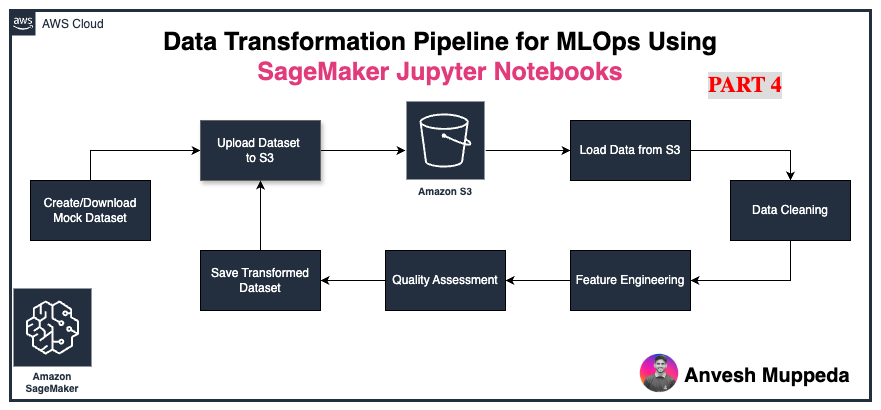

# Simple Data Processing with AWS SageMaker JupyterLab: A Beginner's Guide

*Learn the fundamentals of data transformation using SageMaker Studio*



Data preprocessing is a fundamental skill every data scientist needs to master. In this tutorial, I'll show you how to build a simple data transformation pipeline using **Amazon SageMaker Studio with JupyterLab** to clean and prepare data for machine learning.

## What You'll Learn

In this hands-on tutorial, we'll cover:

✅ Setting up SageMaker Studio environment  
✅ Creating and uploading mock datasets  
✅ Basic data cleaning techniques  
✅ Simple feature engineering  
✅ Storing processed data in S3  

**Note**: *This is a beginner-friendly example focused on learning core concepts, not a production-ready pipeline.*

## Prerequisites

- AWS Account with SageMaker access
- Basic Python and pandas knowledge
- SageMaker Studio domain set up

## High-Level Pipeline Overview

Our simple data processing pipeline consists of 6 main steps:

### 1. **Environment Setup**
- Initialize SageMaker Studio session
- Configure S3 bucket and AWS credentials
- Import required libraries (pandas, boto3, numpy)

### 2. **Data Generation & Upload**
- Create mock employee dataset (20K records)
- Simulate realistic missing data patterns
- Upload raw data to S3 for processing

### 3. **Data Exploration**
- Load dataset from S3
- Analyze data types and structure
- Identify missing values and quality issues

### 4. **Data Cleaning**
- Handle missing values using median imputation
- Parse JSON profile data into separate columns
- Clean categorical variables

### 5. **Feature Engineering**
- Create address length feature
- Build salary categories (low/medium/high)
- Generate age group classifications
- Calculate department-level statistics

### 6. **Export & Validation**
- Save cleaned dataset to S3
- Generate basic quality metrics
- Prepare data for future ML workflows

## Key Learning Points

### **Missing Data Strategies**
- **Numerical columns**: Use median imputation for robustness
- **Categorical columns**: Create 'Unknown' category to preserve information
- **JSON data**: Extract nested information into structured columns

### **Feature Engineering Basics**
- Transform continuous variables into categories
- Create derived metrics from existing data
- Generate aggregated statistics by groups

### **SageMaker Integration**
- Leverage S3 for scalable data storage
- Use pandas for data manipulation within notebooks
- Set up proper IAM roles and permissions

## Code Walkthrough

The complete implementation is available in my GitHub repository:

🔗 **[View Complete Notebook on GitHub](https://github.com/anveshmuppeda/mlops/blob/main/006-sagemaker-dataprocessing-jobs/data_transformation.ipynb)**

### Sample Code Snippets

**Environment Setup:**
```python
import sagemaker
import boto3
import pandas as pd

# Initialize SageMaker session
sagemaker_session = sagemaker.Session()
role = sagemaker.get_execution_role()
bucket = sagemaker_session.default_bucket()
```

**Data Cleaning:**
```python
# Handle missing values
df['age'] = df['age'].fillna(df['age'].median())
df['salary'] = df['salary'].fillna(df['salary'].median())
df['department'] = df['department'].fillna('Unknown')
```

**Feature Engineering:**
```python
# Create salary categories
bins = [0, 50000, 70000, 100000]
labels = ['low', 'medium', 'high']
df['salary_category'] = pd.cut(df['salary'], bins=bins, labels=labels)
```

## Tools Used

- **Amazon SageMaker Studio**: Cloud-based ML development environment
- **JupyterLab**: Interactive notebook interface within SageMaker
- **Python Libraries**: pandas, boto3, numpy, json
- **Amazon S3**: Object storage for input/output data

## Results

After processing, our pipeline successfully:

📊 **Processed 20,000 employee records**  
🧹 **Cleaned missing data** (reduced from 30% to <5% missing values)  
🎯 **Created 4 new engineered features**  
💾 **Stored clean dataset** in S3 for future use  
📈 **Generated department statistics** for business insights  

## Why Start Simple?

This tutorial focuses on fundamental concepts rather than production complexity because:

- **Learning Focus**: Master basic data processing workflows first
- **Accessibility**: Easy to follow and replicate
- **Foundation Building**: Core skills transfer to advanced pipelines
- **Practical Application**: Real scenarios you'll encounter daily

## Next Steps

To advance your skills:

1. **Scale Up**: Process larger datasets using SageMaker Processing Jobs
2. **Automate**: Build scheduled pipelines with Step Functions
3. **Monitor**: Add data quality checks and alerting
4. **Deploy**: Create reusable processing containers
5. **Integrate**: Connect to real data sources (RDS, Redshift, etc.)

## Getting Started

1. **Clone the repository**:
   ```bash
   git clone https://github.com/anveshmuppeda/mlops.git
   ```

2. **Open SageMaker Studio** and navigate to the notebook

3. **Follow along** with the step-by-step implementation

4. **Experiment** with your own datasets and transformations

## Conclusion

Data preprocessing might not be glamorous, but it's the foundation of successful machine learning projects. This simple example demonstrates core concepts you'll use daily as a data scientist.

The beauty of SageMaker Studio is that it provides a familiar Jupyter environment with powerful cloud infrastructure behind it. You can start simple like this tutorial and gradually scale to production-ready pipelines.

---

**Ready to dive deeper?** Check out the complete notebook implementation and start building your own data processing pipelines today!

🔗 **[Complete Code on GitHub](https://github.com/anveshmuppeda/mlops/blob/main/006-sagemaker-dataprocessing-jobs/data_transformation.ipynb)**

---

*Found this helpful? Follow me for more AWS and MLOps tutorials! 👍*