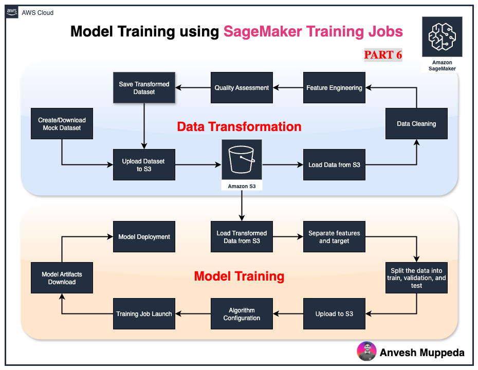
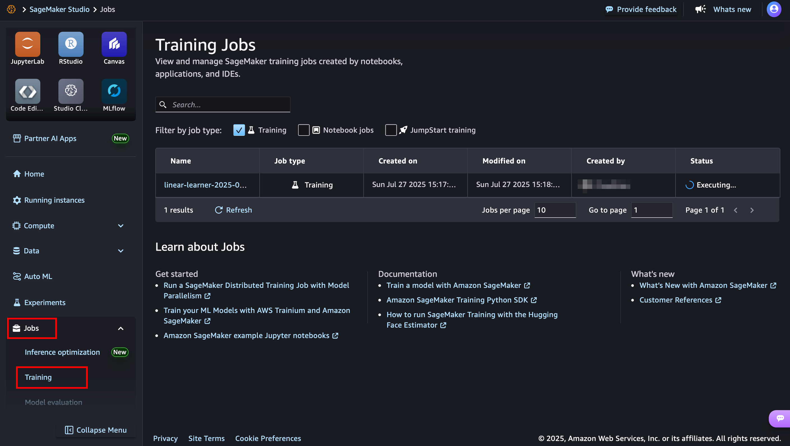
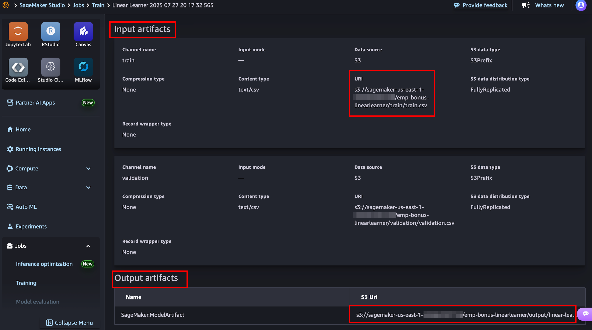
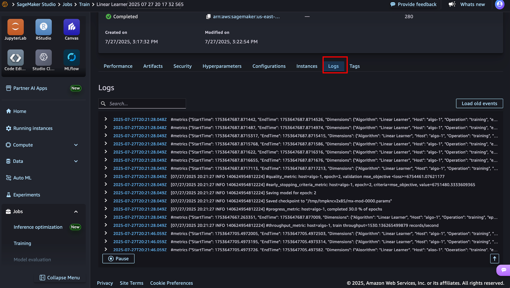

# MLOps with AWS Series - Part 7: Training Models with Amazon SageMaker Linear Learner

*Learn how to train machine learning models at scale using Amazon SageMaker's built-in Linear Learner algorithm. This is Part 5 of our complete MLOps with AWS series.*



This notebook demonstrates the complete machine learning model training pipeline using Amazon SageMaker's built-in Linear Learner algorithm. This is the 6th part of our ML pipeline:

**Pipeline Overview:**
1. **Data Processing Notebook** (Previous): Data transformation, feature engineering, and preprocessing
2. **Model Training Notebook** (Current): Model training, deployment, and evaluation

**What this notebook accomplishes:**
- Loads the preprocessed employee bonus dataset from S3 (generated by our data processing notebook)
- Splits data into training, validation, and test sets
- Trains a Linear Learner model using SageMaker's managed training infrastructure
- Deploys the trained model to a real-time inference endpoint
- Evaluates model performance with visualizations and metrics
- Downloads the trained model artifacts for future use

**Prerequisites:**
- Complete data processing notebook: [Data Processing Notebook](./data_transformation_jupyterlab.ipynb)
- Transformed data available in S3: `s3://{bucket}/output/transformed_data.csv`
- SageMaker execution role with necessary permissions


## What You'll Learn in This Part

By the end of this tutorial, you'll know how to:
- Configure SageMaker training environments
- Use SageMaker's built-in Linear Learner algorithm
- Set up training and validation data channels
- Launch managed training jobs
- Download trained model artifacts
- Understand SageMaker training best practices

**Focus:** Pure model training using AWS managed infrastructure

---

## Prerequisites

Before starting this part, make sure you have:
- ✅ Completed Parts 1-4 of this series
- ✅ Processed employee data available in S3 (`transformed_data.csv`)
- ✅ AWS SageMaker execution role configured
- ✅ Basic understanding of machine learning concepts

---

## The Training Pipeline

Our training process follows this flow:

```
Processed Data (S3) → Data Splitting → SageMaker Training → Trained Model Artifacts
```

---

## Step 1: Environment Setup

### Initialize SageMaker Session
```python
import sagemaker
from sagemaker import get_execution_role
import boto3
import pandas as pd
from sklearn.model_selection import train_test_split
import os

# Set up SageMaker environment
sagemaker_session = sagemaker.Session()
role = get_execution_role()  # IAM role with SageMaker permissions
bucket = sagemaker_session.default_bucket()
prefix = 'emp-bonus-linearlearner'

print(f"Using S3 bucket: {bucket}")
print(f"Training artifacts location: s3://{bucket}/{prefix}/")
```

**What's happening:**
- SageMaker session manages all AWS service interactions
- Execution role provides necessary permissions
- S3 bucket stores training data and model outputs

---

## Step 2: Data Preparation for Training

### Load Processed Data
```python
# Load the transformed dataset from our previous pipeline steps
df = pd.read_csv(f's3://{bucket}/output/transformed_data.csv')

print(f"Dataset shape: {df.shape}")
print("Features available:", df.columns.tolist())
```

### Split Data for Training
```python
# Separate features and target variable
X = df.drop(columns=['bonus'])  # Features
y = df['bonus']                 # Target (what we want to predict)

# Create train/validation/test splits (70/20/10)
X_train, X_temp, y_train, y_temp = train_test_split(
    X, y, test_size=0.3, random_state=42
)
X_val, X_test, y_val, y_test = train_test_split(
    X_temp, y_temp, test_size=0.33, random_state=42
)

print(f"Training samples: {X_train.shape[0]}")
print(f"Validation samples: {X_val.shape[0]}")
print(f"Test samples: {X_test.shape[0]}")
```

**Why this split:**
- **Training (70%):** Used to train the model
- **Validation (20%):** Used during training to prevent overfitting
- **Test (10%):** Reserved for final evaluation (covered in Part 6)

---

## Step 3: Format Data for SageMaker

### SageMaker Data Requirements
```python
# SageMaker Linear Learner expects:
# 1. Target variable as the FIRST column
# 2. No headers in CSV files
# 3. Comma-separated values

# Prepare training data
train_data = pd.concat([y_train, X_train], axis=1)
val_data = pd.concat([y_val, X_val], axis=1)

# Save locally without headers
os.makedirs('data', exist_ok=True)
train_data.to_csv('data/train.csv', index=False, header=False)
val_data.to_csv('data/validation.csv', index=False, header=False)

print("Data formatted for SageMaker Linear Learner")
```

### Upload to S3
```python
# Upload training data to S3
train_path = sagemaker_session.upload_data(
    'data/train.csv', 
    bucket=bucket, 
    key_prefix=f'{prefix}/train'
)

val_path = sagemaker_session.upload_data(
    'data/validation.csv', 
    bucket=bucket, 
    key_prefix=f'{prefix}/validation'
)

print(f"Training data: {train_path}")
print(f"Validation data: {val_path}")
```

---

## Step 4: Configure Linear Learner Algorithm

### Why Linear Learner?
- **Built-in algorithm:** No custom code required
- **Scalable:** Handles large datasets efficiently  
- **Multiple models:** Trains multiple models simultaneously
- **Automatic optimization:** Finds best hyperparameters

### Setup the Estimator
```python
from sagemaker.estimator import Estimator

# Get the Linear Learner container image
linear_learner_container = sagemaker.image_uris.retrieve(
    'linear-learner', 
    sagemaker_session.boto_region_name
)

# Configure the training job
linear_estimator = Estimator(
    image_uri=linear_learner_container,
    role=role,
    instance_count=1,                    # Number of training instances
    instance_type='ml.m5.large',        # Instance type for training
    output_path=f's3://{bucket}/{prefix}/output',  # Model artifacts location
    sagemaker_session=sagemaker_session
)

print("Linear Learner estimator configured")
```

### Set Hyperparameters
```python
# Configure algorithm-specific settings
linear_estimator.set_hyperparameters(
    predictor_type='regressor',    # Regression (predicting continuous values)
    mini_batch_size=32,            # Batch size for training
    epochs=10                      # Number of complete passes through data
)

print("Hyperparameters set for regression training")
```

**Key hyperparameters explained:**
- **predictor_type:** 'regressor' for continuous values, 'binary_classifier' for yes/no
- **mini_batch_size:** How many samples to process at once
- **epochs:** How many times to see the entire dataset

---

## Step 5: Launch Training Job

### Start Training
```python
from sagemaker.inputs import TrainingInput

# Define input data channels
train_input = TrainingInput(s3_data=train_path, content_type='text/csv')
val_input = TrainingInput(s3_data=val_path, content_type='text/csv')

# Launch the training job
print("Starting SageMaker training job...")
print("This will take 3-5 minutes...")

linear_estimator.fit({
    'train': train_input, 
    'validation': val_input
})

print("Training completed successfully! 🎉")
```

### What Happens During Training:
1. **Infrastructure provisioning:** SageMaker launches ML compute instances
2. **Data loading:** Training data is downloaded from S3
3. **Model training:** Linear Learner algorithm trains multiple models
4. **Validation:** Best model is selected based on validation performance
5. **Artifact storage:** Trained model is saved to S3
6. **Cleanup:** Training instances are automatically terminated




---

## Step 6: Training Job Monitoring

### View Training Progress
```python
# Get training job details
training_job_name = linear_estimator.latest_training_job.name
print(f"Training job name: {training_job_name}")

# Training metrics are automatically logged
print("Training metrics:")
print("- Loss function values")
print("- Validation accuracy")
print("- Training time")
print("- Resource utilization")
```


### Understanding Training Logs
The training output shows:
- **Epoch progress:** How many times data has been processed
- **Loss values:** How well the model is learning (lower = better)
- **Validation metrics:** Performance on unseen data
- **Resource usage:** CPU, memory, and time consumption


---

## Step 7: Model Artifacts Management

### Download Trained Model
```python
# Download model artifacts for backup or offline use
local_model_path = 'data/model.tar.gz'

# Get S3 location of trained model
s3 = boto3.client('s3')
s3.download_file(
    Bucket=bucket,
    Key=f'{prefix}/output/{training_job_name}/output/model.tar.gz',
    Filename=local_model_path
)

print(f"Model downloaded to: {local_model_path}")
print(f"Model size: {os.path.getsize(local_model_path) / 1024 / 1024:.2f} MB")
```

### Model Artifacts Structure
```
model.tar.gz contains:
├── model_algo-1              # Primary model file
├── model_algo-2              # Alternative model variations
└── manifest.json             # Model metadata
```

---

## Training Best Practices

### 🚀 **Performance Optimization**
```python
# For larger datasets, consider:
linear_estimator.set_hyperparameters(
    predictor_type='regressor',
    mini_batch_size=100,           # Larger batch size
    epochs=15,                     # More training iterations
    num_models=32,                 # Train more model variants
    loss='squared_loss'            # Explicit loss function
)
```

### 💰 **Cost Optimization**
- **Instance types:** Use `ml.m5.large` for small datasets, `ml.m5.xlarge` for larger ones
- **Spot instances:** Use spot training for up to 90% cost savings
- **Early stopping:** Enable to stop training when performance plateaus

### 📊 **Data Best Practices**
- **Validation size:** Keep 15-25% of data for validation
- **Feature scaling:** Ensure features are properly normalized (done in Part 4)
- **Missing values:** Handle before training (done in Part 3)

---

## Troubleshooting Common Issues

### ❌ **"ResourceLimitExceeded" Error**
```python
# Solution: Use smaller instance type or fewer instances
instance_type='ml.m5.large'  # Instead of ml.m5.xlarge
instance_count=1             # Start with single instance
```

### ❌ **"DataFormatError" Error**
```python
# Solution: Verify data format
# Target variable must be FIRST column, no headers
train_data = pd.concat([y_train, X_train], axis=1)
train_data.to_csv('train.csv', index=False, header=False)
```

### ❌ **"RoleAccessDenied" Error**
```python
# Solution: Ensure SageMaker execution role has S3 permissions
# Check IAM role has AmazonSageMakerFullAccess policy
```

---

## Training Costs & Time

### Estimated Training Costs:
- **ml.m5.large:** ~$0.10 per hour
- **Typical training time:** 3-10 minutes
- **Cost per training run:** $0.05-0.20

### Time Breakdown:
- Instance provisioning: 1-2 minutes
- Data download: 30 seconds
- Actual training: 1-5 minutes
- Model upload: 30 seconds
- Instance cleanup: 1 minute

---

## What's Next?

In **Part 7: Model Evaluation and Validation**, we'll cover:
- Loading trained models for evaluation
- Generating predictions on test data
- Creating performance visualizations
- Calculating evaluation metrics (MAE, RMSE, R²)
- Residual analysis and error patterns

**Coming up in the series:**
- Part 8: Deploying models to real-time endpoints
- Part 9: Setting up model monitoring and alerts

---

## Key Takeaways

✅ **SageMaker simplifies training:** No infrastructure management required  
✅ **Built-in algorithms:** Linear Learner handles common ML tasks  
✅ **Automatic scaling:** Training adapts to data size  
✅ **Cost-effective:** Pay only for training time  
✅ **Production-ready:** Models ready for deployment  

**Training is just one step** in the MLOps pipeline. The real value comes from proper evaluation, deployment, and monitoring.

---

## Resources

- 📖 **SageMaker Linear Learner Documentation**
- 🔗 **Previous Parts:** [Links to Parts 1-4]
- 🔗 **Next Part:** Model Evaluation and Validation
- 💬 **Questions?** Drop a comment below!

---

*This is Part 5 of our MLOps with AWS series. Follow along to build a complete, production-ready machine learning pipeline.*

**Tags:** #MLOps #AWS #SageMaker #MachineLearning #ModelTraining #LinearLearner