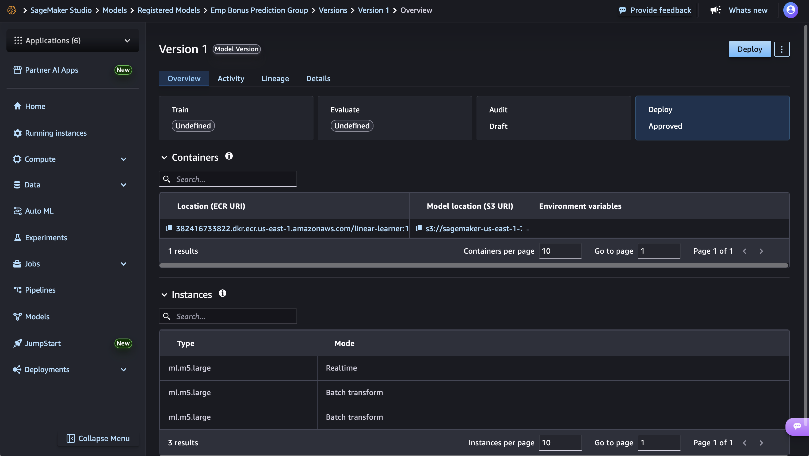

# 📦 Model Registry and Versioning with Amazon SageMaker 🛠️
⇢ MLOps with AWS Series — Part 7


## Overview
In this guide, we'll learn how to register and manage machine learning models using Amazon SageMaker Model Registry. This is a crucial step in MLOps that enables proper model governance, versioning, and lifecycle management.

## What You'll Learn
- How to create a Model Package Group in SageMaker Model Registry
- Register trained models with metadata and versioning
- Manage model approval workflows
- Retrieve and track different model versions

## Prerequisites
- Completion of **[Part 6: Training ML Models with Amazon SageMaker Linear Learner](./../007-sagemaker-model-training/README.md)**
- A trained model artifact (model.tar.gz) from the previous tutorial
- Basic understanding of SageMaker concepts

---

## Step-by-Step Implementation

### Step 1: Environment Setup and Dependencies
```python
# Essential imports for SageMaker Model Registry operations
import sagemaker
from sagemaker import get_execution_role
import boto3
import pandas as pd
from sklearn.model_selection import train_test_split
import os
import time
from sagemaker.session import Session
from sagemaker import Model
from sagemaker import ModelPackage

# Initialize SageMaker session and execution role
# The execution role provides necessary permissions for SageMaker operations
sagemaker_session = sagemaker.Session()
role = get_execution_role()

# Configure S3 storage for model artifacts
# Using default SageMaker bucket for consistency across the series
s3_bucket = sagemaker_session.default_bucket()
s3_prefix = 'emp-bonus-linearlearner'  # Organized folder structure

print(f"Using bucket: {s3_bucket}")
```

**Key Points:**
- We're using the same S3 bucket and prefix from Part 6 for consistency
- The execution role is automatically configured with necessary SageMaker permissions

### Step 2: Prepare Model for Registry
```python
# Upload the trained model artifact to S3
# This model.tar.gz was created in Part 6 during the training process
local_file_path = 'data/model.tar.gz'
s3_uri = sagemaker_session.upload_data(local_file_path, bucket=s3_bucket, key_prefix=s3_prefix)
print(f"File uploaded to: {s3_uri}")

# Construct the full S3 path for the model artifact
model_artifact = f's3://{s3_bucket}/{s3_prefix}/model.tar.gz'

# Get the appropriate container image for Linear Learner
# SageMaker provides pre-built containers for different algorithms
region = sagemaker_session.boto_region_name
container_image_uri = sagemaker.image_uris.retrieve(framework="linear-learner", region=region)

print(f"Model artifact location: {model_artifact}")
print(f"SageMaker Linear Learner Image URI: {container_image_uri}")

# Create a SageMaker Model object
# This represents our trained model and its deployment configuration
model_name = 'emp-bonus'  # Descriptive name for identification

model = Model(
    image_uri=container_image_uri,      # Pre-built Linear Learner container
    model_data=model_artifact,          # S3 path to our trained model
    role=get_execution_role(),          # IAM role for permissions
    sagemaker_session=sagemaker_session,
    name=model_name
)
```

**Key Points:**
- The model artifact contains the serialized trained model from Part 6
- We use SageMaker's pre-built Linear Learner container image
- The Model object encapsulates everything needed for deployment

### Step 3: Create Model Package Group
```python
# Model Package Groups organize related model versions
# Think of it as a "project" or "use case" container for your models
model_package_group_name = 'emp-bonus-prediction-group'
model_package_group_description = 'SageMaker model package group for employee bonus prediction'
sagemaker_client = boto3.client('sagemaker')

try:
    # Create the model package group
    # This is a one-time setup per model use case
    sagemaker_client.create_model_package_group(
        ModelPackageGroupName=model_package_group_name,
        ModelPackageGroupDescription=model_package_group_description
    )
    print(f'Created Model Package Group: {model_package_group_name}')
    
except sagemaker_client.exceptions.ResourceInUse:
    # Handle case where group already exists
    print(f'Model Package Group {model_package_group_name} already exists.')
```


**Key Points:**
- Model Package Groups provide organizational structure
- Each group can contain multiple versions of related models
- Groups enable governance policies and approval workflows

### Step 4: Register Model in Model Registry
```python
# Configure model registration parameters
model_approval_status = "PendingManualApproval"  # Requires manual approval before use
customer_metadata_properties = {"ModelType": "EmpBonusPrediction"}  # Custom metadata for tracking

print(f"Approval Status: {model_approval_status}")
print(f"Model Package Group: {model_package_group_name}")
print(f"Custom Metadata: {customer_metadata_properties}")

# Register the model in the Model Registry
# This creates a versioned entry with all necessary metadata
model_package = model.register(
    content_types=["text/csv"],                    # Input data format
    response_types=["text/csv"],                   # Output data format
    inference_instances=["ml.m5.large"],           # Supported instance types for real-time inference
    transform_instances=["ml.m5.large"],           # Supported instance types for batch transform
    model_package_group_name=model_package_group_name,
    approval_status=model_approval_status,         # Governance control
    customer_metadata_properties=customer_metadata_properties  # Custom tracking metadata
)

print(f"Model package version ARN: {model_package.model_package_arn}")
```

**Key Points:**
- Each registration creates a new version automatically
- Approval status controls model deployment eligibility
- Instance type specifications guide deployment decisions
- Custom metadata enables better model tracking and governance

 

### Step 5: Retrieve and Manage Model Versions
```python
# Fetch the latest approved model from the registry
# This is typically used in production deployment pipelines
response = sagemaker_client.list_model_packages(
    ModelPackageGroupName=model_package_group_name,
    ModelApprovalStatus='Approved',  # Only get production-ready models
    SortBy='CreationTime',
    SortOrder='Descending'           # Latest first
)

# Get the most recent approved model
if response['ModelPackageSummaryList']:
    latest_model_package_arn = response['ModelPackageSummaryList'][0]['ModelPackageArn']
    print(f'Latest Approved Model Package ARN: {latest_model_package_arn}')
else:
    print('No approved models found in the registry')

# Fetch all model versions regardless of approval status
# Useful for model governance and version tracking
response = sagemaker_client.list_model_packages(
    ModelPackageGroupName=model_package_group_name,
    SortBy='CreationTime',
    SortOrder='Descending'
)

print("\nAll model versions with their approval status:\n")

# Display comprehensive model version information
for model_pkg in response['ModelPackageSummaryList']:
    arn = model_pkg['ModelPackageArn']
    status = model_pkg.get('ModelApprovalStatus', 'N/A')
    creation_time = model_pkg.get('CreationTime', 'N/A')
    print(f"ARN: {arn}")
    print(f"Status: {status}")
    print(f"Created: {creation_time}")
    print("-" * 50)
```

**Key Points:**
- Model Registry maintains complete version history
- Approval status enables governance workflows
- ARNs provide unique identifiers for each model version
- Creation timestamps help track model evolution




---

## Best Practices Demonstrated

### 1. **Governance and Approval Workflows**
- Models start with "PendingManualApproval" status
- Production deployments should only use "Approved" models
- Rejected models remain in registry for audit purposes

### 2. **Metadata Management**
- Custom metadata properties for better model tracking
- Consistent naming conventions across the MLOps pipeline
- Comprehensive documentation of model capabilities

### 3. **Version Control**
- Automatic versioning for each model registration
- Clear separation between development and production models
- Ability to rollback to previous versions if needed

### 4. **Infrastructure Specification**
- Pre-defined instance types for different use cases
- Consistent data format specifications
- Scalable deployment configurations

---

## Next Steps
In **Part 8**, we'll explore model deployment strategies using the registered models, including:
- Real-time inference endpoints
- Batch transform jobs
- Multi-model endpoints
- A/B testing deployments

## Key Takeaways
✅ Model Registry provides centralized model management  
✅ Versioning enables safe model evolution and rollbacks  
✅ Approval workflows ensure production quality gates  
✅ Metadata tracking improves model governance  
✅ Integration with MLOps pipelines streamlines deployment  

---

*This guide is part of our comprehensive MLOps with AWS series. Each tutorial builds upon previous concepts to create a complete machine learning operations workflow.*
