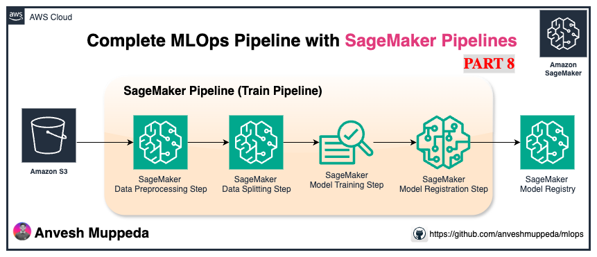
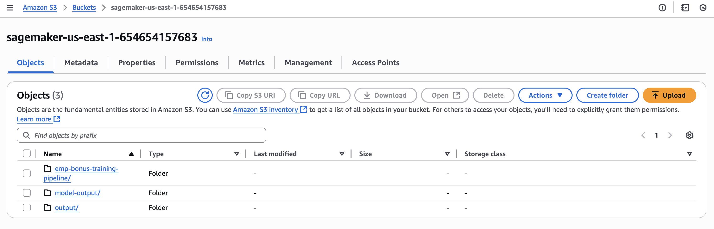
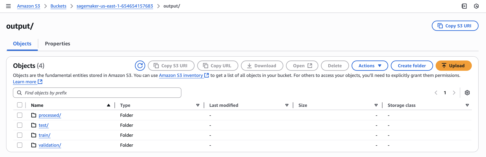
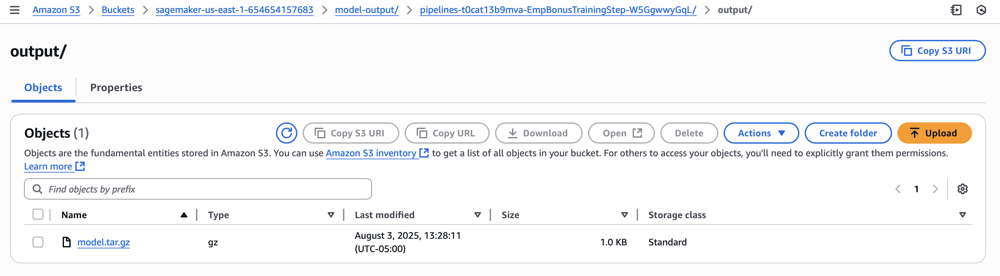
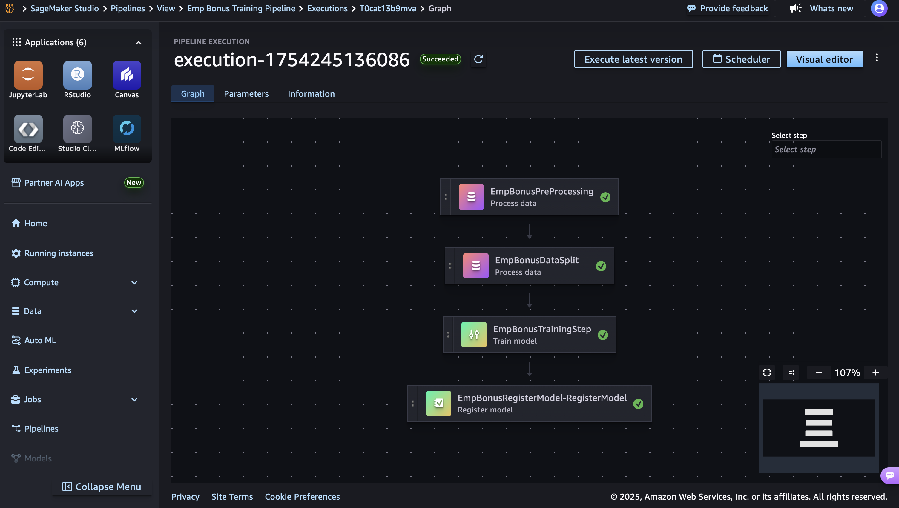
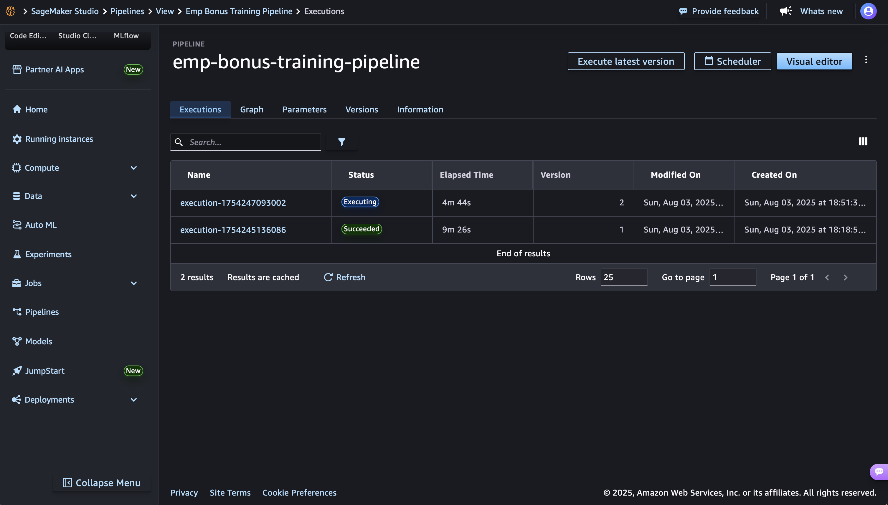
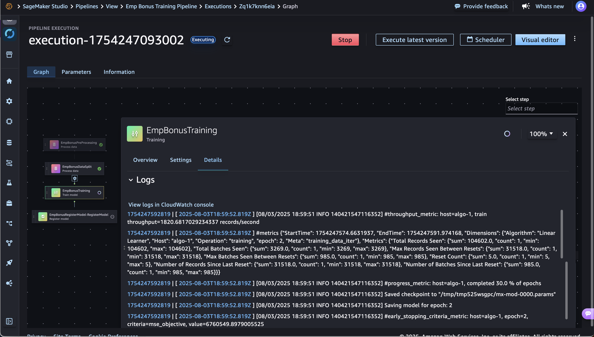
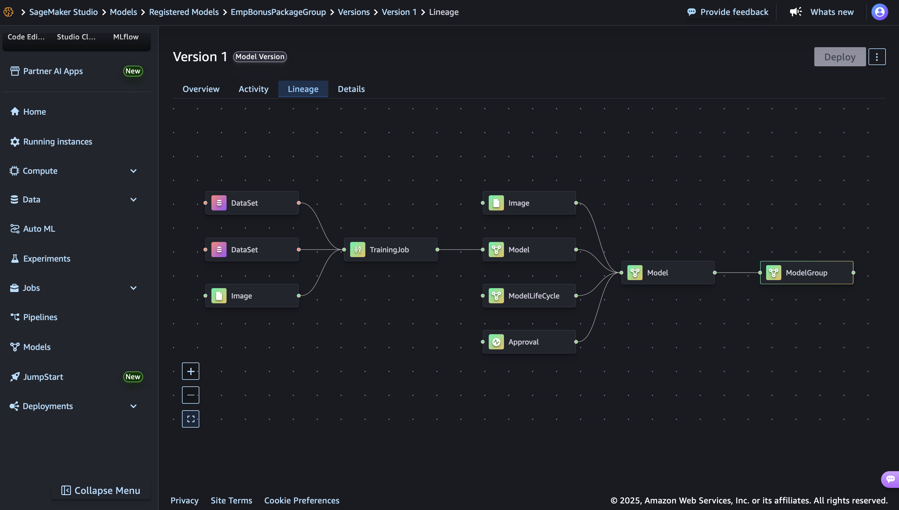

# Complete MLOps Pipeline with SageMaker Pipelines
## Employee Bonus Prediction - End-to-End Machine Learning Workflow
*⇢ MLOps with AWS Series — Part 8*  



This notebook demonstrates a complete MLOps pipeline using Amazon SageMaker Pipelines for predicting employee bonuses. The pipeline includes data preprocessing, model training, and model registration with proper governance.

---

## 🎯 **What We'll Build**

A production-ready ML pipeline that:
- ✅ Preprocesses raw employee data automatically
- ✅ Splits data into train/validation/test sets
- ✅ Trains a Linear Learner model for regression
- ✅ Registers the model in SageMaker Model Registry
- ✅ Implements proper MLOps governance and approval workflows

---

## 📋 **Pipeline Architecture**

```
Raw Data → Preprocessing → Data Split → Model Training → Model Registration
    ↓           ↓            ↓             ↓              ↓
 CSV File → Clean & Transform → Train/Val/Test → Linear Learner → Model Registry
```

---

## **Step 1: Environment Setup and Configuration**

### 🔧 **Purpose**: 
Initialize SageMaker environment, configure AWS resources, and set up pipeline parameters.

### 🎯 **What happens here**:
- Import required SageMaker libraries
- Set up execution roles and sessions
- Configure S3 buckets for data storage
- Define pipeline parameters for flexibility

```python
import boto3 
import pandas as pd 
import sagemaker
from sagemaker.workflow.pipeline_context import PipelineSession 
from sagemaker.workflow.parameters import ( 
 ParameterInteger,
 ParameterString)

s3_client = boto3.resource('s3') 
pipeline_name = f"emp-bonus-training-pipeline"
sagemaker_session = sagemaker.Session()
region = sagemaker_session.boto_region_name
role = sagemaker.get_execution_role()
pipeline_session = PipelineSession()
default_bucket = sagemaker_session.default_bucket()

# Model Package Group - Create this manually in SageMaker Console first
# In next iteration, we'll create this programmatically within the pipeline
model_package_group_name = f"EmpBonusPackageGroup"

print(f"Default S3 Bucket Name: {default_bucket}")
print(f"Model Package Group Name: {model_package_group_name}")
```

### 📝 **Key Configuration Parameters**

```python
base_job_prefix = "emp-bonus"
processing_instance_count = ParameterInteger(name="ProcessingInstanceCount", default_value=1)
processing_instance_type = ParameterString(name="ProcessingInstanceType", default_value="ml.m5.xlarge") 
training_instance_type = ParameterString(name="TrainingInstanceType", default_value="ml.m5.xlarge") 
input_data = "data/mock_data.csv" 
model_approval_status = ParameterString(name="ModelApprovalStatus", default_value="PendingManualApproval")
```

**💡 Why parameters?** These allow you to modify instance types, approval status, and other settings without changing the pipeline code.

---

## **Step 2: Data Preprocessing**

### 🔧 **Purpose**: 
Clean, transform, and prepare raw employee data for machine learning.

### 🎯 **What the preprocessing script does**:
- **Missing Value Handling**: Fills missing age/salary with median values
- **JSON Parsing**: Extracts address, phone, email from profile JSON column
- **Feature Engineering**: Creates address_length, salary_category, age_group features
- **Data Cleaning**: Removes unnecessary columns and handles data types
- **Output**: Produces `cleaned_data.csv` and `transformed_data.csv`

```python
from sagemaker.sklearn.processing import SKLearnProcessor
from sagemaker.processing import ProcessingInput, ProcessingOutput
from sagemaker.workflow.steps import ProcessingStep

framework_version = "1.0-1"

sklearn_processor = SKLearnProcessor(
    framework_version=framework_version,
    instance_type=processing_instance_type,
    instance_count=processing_instance_count,
    base_job_name="emp-pre-processing",
    role=role,
    sagemaker_session=pipeline_session,
)

processor_args = sklearn_processor.run(
    inputs=[
      ProcessingInput(source=input_data, destination="/opt/ml/processing/input"),
    ],
    outputs=[
        ProcessingOutput(output_name="processed-data", source='/opt/ml/processing/output',
                         destination=f"s3://{default_bucket}/output/processed")
    ],
    code=f"preprocessing_script.py",
)
step_preprocess = ProcessingStep(name="EmpBonusPreProcessing", step_args=processor_args)
```

**📋 Preprocessing Tasks Overview**:
1. **Load** raw CSV data
2. **Handle missing values** in age, salary, department
3. **Extract features** from JSON profile column  
4. **Create new features** (address_length, salary_category, age_group)
5. **Convert categorical** variables to dummy variables
6. **Calculate tenure** from hire_date
7. **Save cleaned data** for next step

---



## **Step 3: Data Splitting**

### 🔧 **Purpose**: 
Split the preprocessed data into training, validation, and test sets for model development.

### 🎯 **What happens here**:
- **Reads** transformed data from preprocessing step
- **Splits** data into 70% train, 20% validation, 10% test
- **Saves** three separate CSV files to S3
- **Maintains** data consistency across splits

```python
# This step reads the output from preprocessing and creates train/validation/test splits
input_data = f"s3://{default_bucket}/output/processed/transformed_data.csv"

sklearn_processor = SKLearnProcessor(
    framework_version=framework_version,
    instance_type=processing_instance_type,
    instance_count=processing_instance_count,
    base_job_name="emp-data-split",
    role=role,
    sagemaker_session=pipeline_session,
)

processor_args = sklearn_processor.run(
    inputs=[
      ProcessingInput(source=input_data, destination="/opt/ml/processing/input"),  
    ],
    outputs=[
        ProcessingOutput(output_name="train", source="/opt/ml/processing/train",
                         destination=f"s3://{default_bucket}/output/train"),
        ProcessingOutput(output_name="validation", source="/opt/ml/processing/validation",
                         destination=f"s3://{default_bucket}/output/validation"),
        ProcessingOutput(output_name="test", source="/opt/ml/processing/test",
                         destination=f"s3://{default_bucket}/output/test")
    ],
    code=f"model_training_script.py",  # This should be data_split_script.py
)
step_data_split = ProcessingStep(name="EmpBonusDataSplit", step_args=processor_args, depends_on=[step_preprocess])
```

**📊 Data Split Ratios**:
- **Training Set**: 70% - Used for model training
- **Validation Set**: 20% - Used for hyperparameter tuning and model selection
- **Test Set**: 10% - Used for final model evaluation



---

## **Step 4: Model Training**

### 🔧 **Purpose**: 
Train a Linear Learner regression model to predict employee bonus amounts.

### 🎯 **Why Linear Learner**:
- **Built-in Algorithm**: Managed by AWS, optimized for performance
- **Regression Support**: Perfect for predicting continuous bonus values
- **Scalable**: Automatically handles feature scaling and optimization
- **Fast Training**: Efficient for structured data

```python
from sagemaker.estimator import Estimator
from sagemaker.inputs import TrainingInput
from sagemaker.workflow.steps import TrainingStep

# Retrieve the Linear Learner container image
linear_learner_container = sagemaker.image_uris.retrieve('linear-learner', sagemaker_session.boto_region_name)

# Configure the Linear Learner estimator
linear_estimator = Estimator(
    image_uri=linear_learner_container,
    role=role,
    instance_count=1,
    instance_type=training_instance_type,
    output_path=f's3://{default_bucket}/model-output',
    sagemaker_session=pipeline_session,
    base_job_name="emp-bonus-linear-learner"
)

# Set hyperparameters for regression
linear_estimator.set_hyperparameters(
    predictor_type='regressor',  # Regression problem (predicting bonus amount)
    mini_batch_size=32,          # Batch size for training
    epochs=10                    # Number of training epochs
)

# Define training data inputs
train_path = f"s3://{default_bucket}/output/train/train.csv"
val_path = f"s3://{default_bucket}/output/validation/validation.csv"

train_input = TrainingInput(s3_data=train_path, content_type='text/csv')
val_input = TrainingInput(s3_data=val_path, content_type='text/csv')

# Create the training step
step_training = TrainingStep(
    name="EmpBonusTraining",
    estimator=linear_estimator,
    inputs={
        'train': train_input,
        'validation': val_input
    },
    depends_on=[step_data_split]
)
```

**🎛️ Linear Learner Configuration**:
- **predictor_type**: 'regressor' for continuous bonus prediction
- **mini_batch_size**: 32 samples per batch (good for small datasets)
- **epochs**: 10 iterations through the data
- **Output**: Trained model artifacts saved to S3



---

## **Step 5: Model Registration**

### 🔧 **Purpose**: 
Register the trained model in SageMaker Model Registry for governance and deployment.

### 🎯 **Model Registry Benefits**:
- **Version Control**: Track different model versions
- **Approval Workflow**: Require manual approval before deployment
- **Metadata Storage**: Store model performance metrics and descriptions
- **Deployment Governance**: Control which models go to production

```python
from sagemaker import Model
from sagemaker.workflow.model_step import ModelStep

# Get the Linear Learner container for inference
container_image_uri = sagemaker.image_uris.retrieve(framework="linear-learner", region=region)

# Create model object referencing the training step output
model = Model(
    image_uri=container_image_uri,
    model_data=step_training.properties.ModelArtifacts.S3ModelArtifacts,  # Dynamic reference
    sagemaker_session=pipeline_session,
    role=role,
)

# Configure model registration
model_approval_status = "PendingManualApproval"
customer_metadata_properties = {"ModelType": "EmpBonusPrediction"}

register_args = model.register(
    content_types=["text/csv"],                    # Input format
    response_types=["text/csv"],                   # Output format
    inference_instances=["ml.t2.medium", "ml.m5.xlarge"],  # Deployment options
    transform_instances=["ml.m5.xlarge"],          # Batch transform options
    model_package_group_name=model_package_group_name,     # Registry group
    approval_status=model_approval_status,         # Requires manual approval
    customer_metadata_properties=customer_metadata_properties,
)

step_register = ModelStep(
    name="EmpBonusRegisterModel",
    step_args=register_args
)
```

**📋 Registration Details**:
- **Approval Status**: "PendingManualApproval" - Model waits for human approval
- **Instance Types**: Specifies which EC2 types can be used for deployment
- **Metadata**: Custom properties to categorize the model
- **Content Types**: Defines expected input/output formats

---



## **Step 6: Pipeline Creation and Configuration**

### 🔧 **Purpose**: 
Assemble all steps into a cohesive, executable pipeline with proper dependencies.

### 🎯 **Pipeline Benefits**:
- **Automation**: Run entire workflow with one command
- **Reproducibility**: Same results every time
- **Scalability**: Easy to modify and extend
- **Monitoring**: Track execution and debug issues

```python
from sagemaker.workflow.pipeline import Pipeline

pipeline = Pipeline(
    name=pipeline_name,
    parameters=[
        processing_instance_count,
        processing_instance_type,
        training_instance_type,
        model_approval_status,
        input_data,
    ],
    steps=[step_preprocess, step_data_split, step_training, step_register],
)

# Create or update the pipeline
pipeline.upsert(role_arn=role)
```

**🔄 Pipeline Flow**:
1. **Preprocessing** → Clean and transform raw data
2. **Data Split** → Create train/validation/test sets  
3. **Training** → Train Linear Learner model
4. **Registration** → Register model for approval

**⚙️ Pipeline Parameters** allow runtime customization without code changes.





---

## **Step 7: Pipeline Execution**

### 🔧 **Purpose**: 
Execute the complete MLOps pipeline and monitor progress.

```python
# Start pipeline execution
execution = pipeline.start()

# The pipeline will now run all steps in sequence
print(f"Pipeline execution started: {execution.arn}")
```

### 📊 **Monitoring Your Pipeline**:

1. **SageMaker Console**: Go to Pipelines → Your Pipeline → Executions
2. **Each Step Shows**:
   - ✅ **Status**: Running, Completed, Failed
   - ⏱️ **Duration**: How long each step takes
   - 💰 **Cost**: Instance hours consumed
   - 📋 **Logs**: Detailed execution logs

3. **After Completion**:
   - **Model Registry**: Check for your registered model
   - **S3 Buckets**: Verify processed data and model artifacts
   - **Approval**: Manually approve model in Model Registry

---

## **🎉 What You've Built**

Congratulations! You've created a production-ready MLOps pipeline that:

✅ **Automatically processes** employee data  
✅ **Trains models** with best practices  
✅ **Implements governance** through model registry  
✅ **Enables reproducibility** through parameterization  
✅ **Provides monitoring** and debugging capabilities  

---

## **🚀 Next Steps**

1. **Add Model Evaluation**: Include metrics calculation step
2. **Implement Conditions**: Add conditional logic for model approval
3. **Create Deployment Pipeline**: Automate model deployment after approval
4. **Add Data Quality Checks**: Validate data before training
5. **Implement Hyperparameter Tuning**: Optimize model performance

---

## **📚 Key Concepts Learned**

- **SageMaker Pipelines**: Orchestrating ML workflows
- **Processing Jobs**: Data preprocessing at scale
- **Built-in Algorithms**: Using Linear Learner for regression
- **Model Registry**: Governance and version control
- **Step Dependencies**: Creating logical workflow sequences
- **Pipeline Parameters**: Making workflows flexible and reusable

This pipeline forms the foundation for more advanced MLOps practices in production environments.  