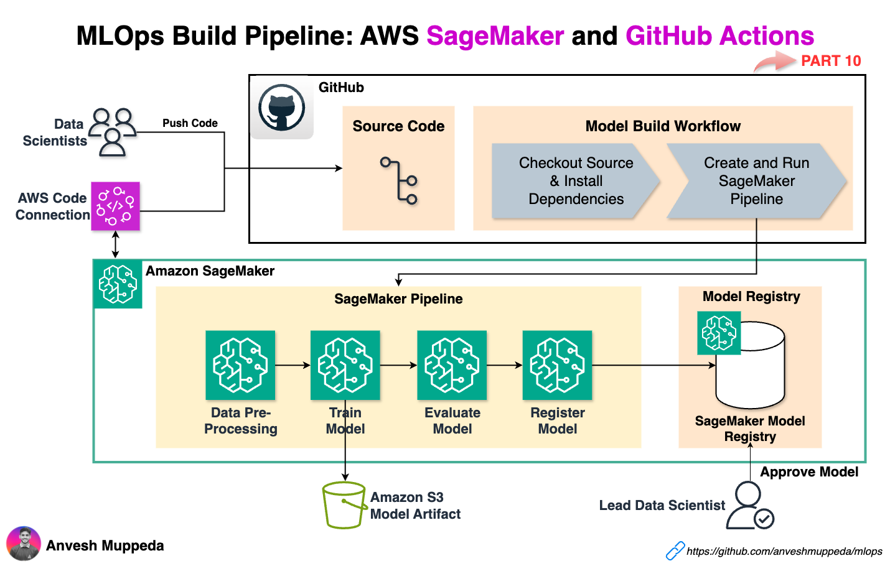
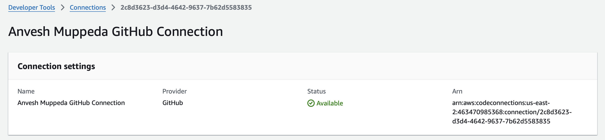
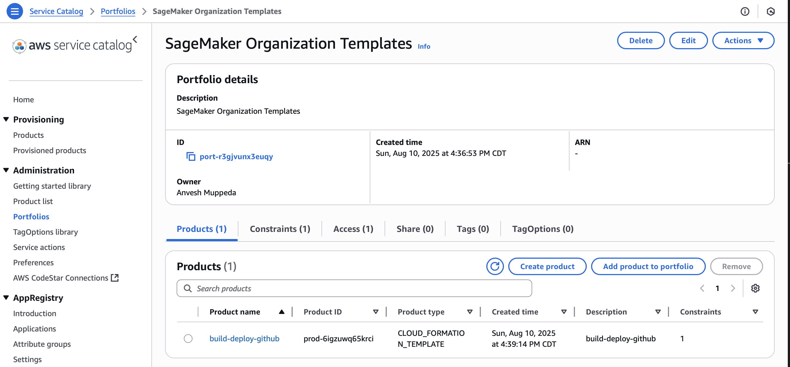
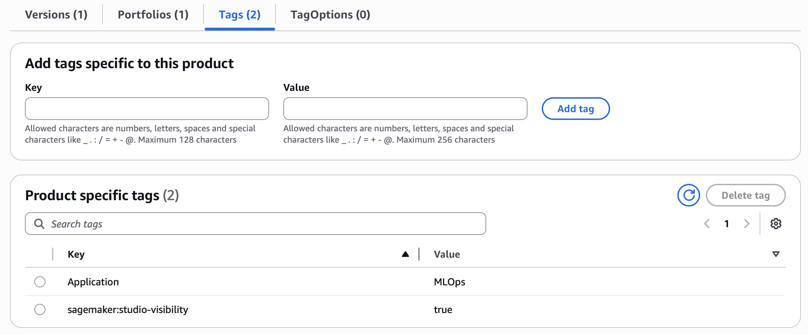
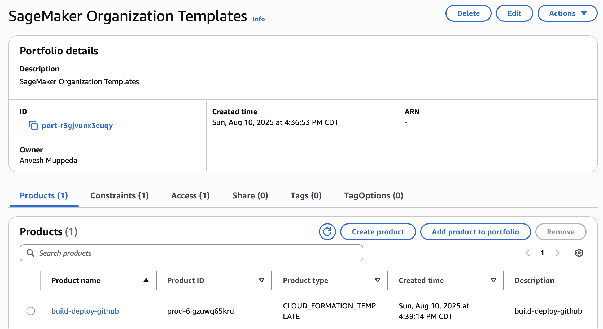
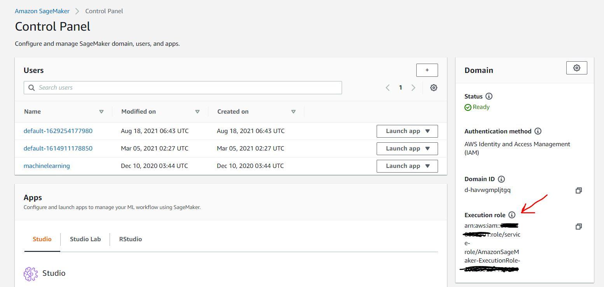
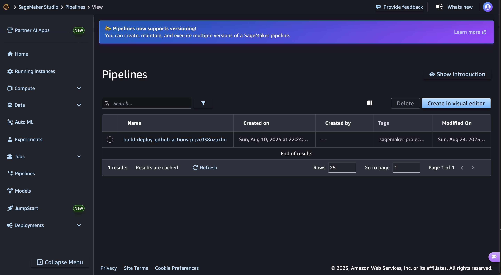
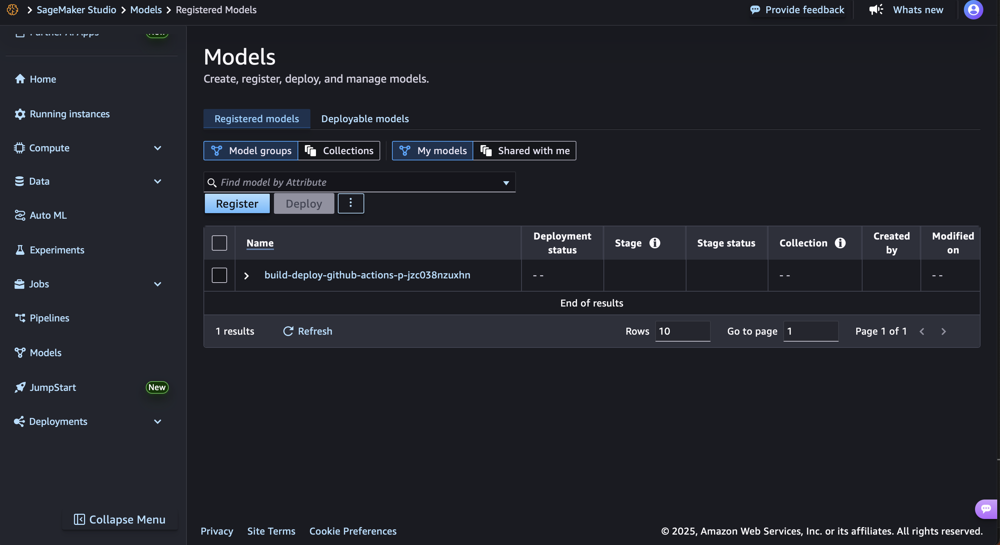
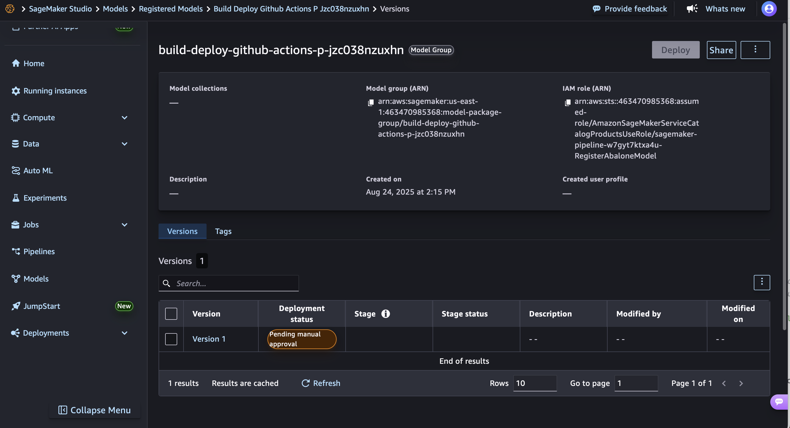

# MLOps Build Pipeline: Automated Model Development Workflows
End-to-End ML Pipeline Automation Using AWS SageMaker Projects and GitHub Actions

This guide demonstrates implementing MLOps practices using Amazon SageMaker and GitHub Actions to create a fully automated model development pipeline.

The automation covers data preparation, model training, model evaluation, and model registration in the SageMaker Model Registry through continuous integration workflows.

## Architecture Overview


## Prerequisites
Complete the following requirements before implementing this MLOps pipeline:

### Configure AWS CodeConnection

Establish a CodeConnection between your AWS account and GitHub repository by following the [AWS CodeConnection setup guide](https://docs.aws.amazon.com/dtconsole/latest/userguide/connections-create-github.html).

Your CodeConnection resource will provide an ARN similar to this format:

```json
{
    "ConnectionArn": "arn:aws:codeconnections:us-west-2:account_id:connection/aEXAMPLE-8aad-4d5d-8878-dfcab0bc441f"
}
```


The unique identifier `2c8d3623-d3d4-4642-9637-7b62d5583835` from this connection will be required during SageMaker project creation.

### Configure IAM User for GitHub Actions
Create a dedicated IAM user to provide GitHub Actions with necessary permissions for AWS resource management.

Apply the permissions defined in [iam/GithubActionsMLOpsExecutionPolicy.json](./iam/GithubActionsMLOpsExecutionPolicy.json) to grant appropriate access for building and deploying ML resources.

Generate access credentials for this IAM user, as these will be configured in GitHub repository secrets.

### Configure GitHub Repository
Prepare your GitHub repository with the required authentication and workflow configuration.

#### Configure GitHub Repository Secrets
Navigate to your GitHub repository settings to configure secure credential storage:

Access your repository Settings → Security section → Secrets and variables → Actions → New repository secret

Configure these required secrets using the IAM user credentials created previously:

1. Create secret `AWS_ACCESS_KEY_ID` with the IAM user's access key identifier
2. Create secret `AWS_SECRET_ACCESS_KEY` with the corresponding secret access key

### Deploy Lambda Infrastructure
Package and deploy the Lambda function that coordinates between SageMaker and GitHub Actions.

Create the deployment package:
```sh
cd lambda_functions/lambda_github_workflow_trigger
zip lambda-github-workflow-trigger.zip lambda_function.py
```

Upload the package to an S3 bucket accessible by AWS Service Catalog for later deployment.

#### Configure Lambda Dependencies Layer
Create a Lambda layer containing the required Python dependencies.

Set up the development environment:
```sh
mkdir lambda_layer
cd lambda_layer
python3 -m venv .env
source .env/bin/activate
pip install pygithub
deactivate
```

Package the dependencies:
```sh
mv .env/lib/python3.9/site-packages/ python
zip -r layer.zip python
```

Deploy the layer to AWS Lambda:
```sh
aws lambda publish-layer-version --layer-name python39-github-arm64 \
    --description "Python3.9 pygithub" \
    --license-info "MIT" \
    --zip-file fileb://layer.zip \
    --compatible-runtimes python3.9 \
    --compatible-architectures "arm64"
```

This layer provides dependency management for Lambda functions requiring GitHub API access.

### Configure Custom SageMaker Project Template
Deploy the CloudFormation template through AWS Service Catalog to enable custom project creation within SageMaker.

Customize the CloudFormation template by updating the S3 bucket reference:

```yaml
GitHubWorkflowTriggerLambda:
    ...
    Code:
        S3Bucket: <your-bucket-name>
        S3Key: lambda-github-workflow-trigger.zip
    ...
```

Configure the Service Catalog portfolio:

1. Access the AWS Service Catalog console at https://console.aws.amazon.com/servicecatalog/

2. Navigate to Administration → Portfolios

3. Select Create a new portfolio

4. Assign the portfolio name **SageMaker Organization Templates**

5. Download the [template.yml](./project/template.yml) CloudFormation template. This template defines all CI/CD infrastructure components required for GitHub Actions integration with SageMaker workflows.

6. Access your newly created portfolio

7. Select **Upload a new product**

8. Configure the product details:
   - Product name: **build-deploy-github**
   - Description: **Custom build and deploy template for MLOps**
   - Owner: **Your name**

9. Under Version details, select **Use a template file**

10. Choose **Upload a template** and select your customized template file

11. Set Version title to **1.0**

12. Review configuration and select **Create product**



13. Refresh the product list to display your new product

14. Select your created product

15. Configure product visibility by adding the following tag in the Tags tab:
    - Key: **sagemaker:studio-visibility**
    - Value: **true**



16. Return to portfolio details view 

17. Navigate to Constraints tab and select **Create constraint**

18. Configure launch constraint:
    - Product: **build-deploy-github**
    - Constraint type: **Launch**
    - Method: **Select IAM role**
    - Role: **AmazonSageMakerServiceCatalogProductsLaunchRole**

19. Select **Create** to apply the constraint

20. Access Groups, roles, and users tab and select **Add groups, roles, users**

21. In the Roles tab, select the IAM role associated with your SageMaker Studio domain configuration 

22. Select **Add access** to complete the configuration

## Create and Configure Your Project

Deploy your custom MLOps project using the configured template.

1. Navigate to Amazon SageMaker in the AWS console

2. Access the SageMaker domain where you want to deploy this project

3. Launch SageMaker Studio from the domain's Launch menu

4. Within Studio, navigate to Deployments → Projects from the left sidebar

5. Select **Create Project**

6. Choose **Organization templates** from the template categories

7. Locate and select your **build-deploy-github** template, then click **Select Project Template**

8. Complete the project configuration with these parameters:
   - **GitHub Repository Owner**: The account owner for your repository (e.g., for `https://github.com/anveshmuppeda/mlops`, enter `anveshmuppeda`)
   - **GitHub Repository Name**: The repository name only (e.g., for `https://github.com/anveshmuppeda/mlops`, enter `mlops`)
   - **CodeConnection Unique ID**: The identifier from your AWS CodeConnection configuration
   - **Secrets Manager Secret Name**: The name of the AWS Secrets Manager secret containing your GitHub token
   - **GitHub Workflow Filename**: The deployment workflow filename, typically `deploy.yml`

9. Select **Create Project** to provision your MLOps infrastructure

10. Update environment variables in your GitHub workflow files located at `.github/workflows/` in your repository:

```yaml
env:
  AWS_REGION: <your-aws-region>
  SAGEMAKER_PROJECT_NAME: <your-project-name>
```

Update both `build.yml` and `deploy.yml` workflow files with these values.

Your automated MLOps environment is now operational.

## Execute and Monitor Your Build Pipeline

Test your automated ML workflow by triggering the build process.

1. Access your GitHub repository

2. Monitor GitHub Actions for the automated **build** workflow execution

3. Track pipeline progress in SageMaker Studio:
   - Navigate to Pipelines in the left sidebar
   - Locate your pipeline named `<project-name>-<project-id>`
   - Access pipeline details to monitor execution progress




4. Verify model registration upon successful build completion:
   - Access SageMaker Console → Models section
   - Locate your new model package group



5. Review the registered model version:
   - Access your model package group
   - Examine the newly created model version



6. Approve the model for deployment:
   - The model version will initially display **Pending manual approval** status
   - Select the model version → Actions → Approve to authorize deployment

## References
- [MLOps using Amazon SageMaker and GitHub Actions](https://aws.amazon.com/blogs/machine-learning/build-an-end-to-end-mlops-pipeline-using-amazon-sagemaker-pipelines-github-and-github-actions/)