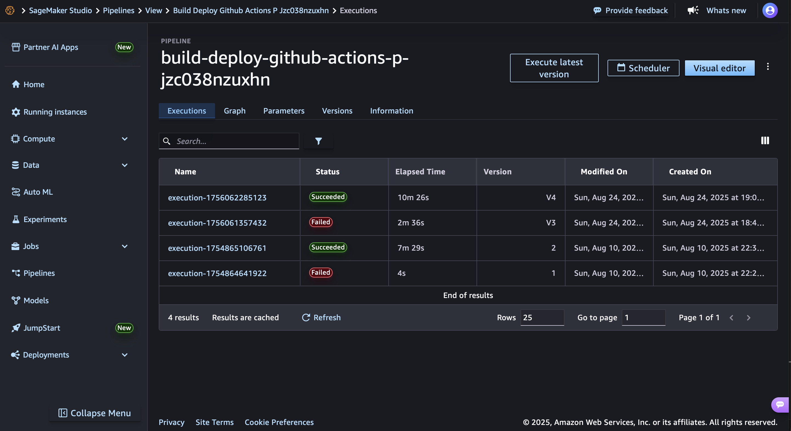
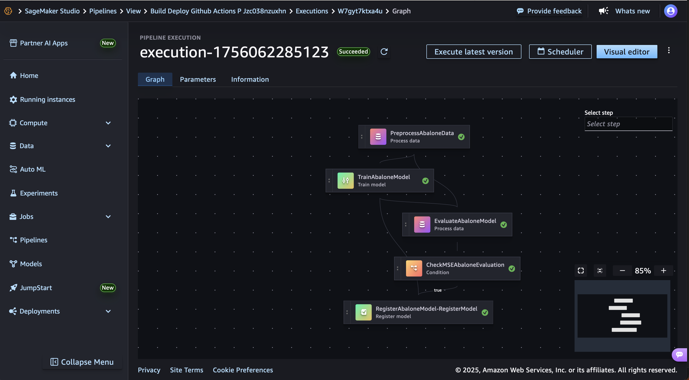

# MLOps using Amazon SageMaker and GitHub Actions
This is an example of MLOps implementation using Amazon SageMaker and GitHub Actions.

In this example, we will automate a model-build pipeline that includes steps for data preparation, model training, model evaluation, and registration of that model in the SageMaker Model Registry. 

## Architecture Overview


## Prerequisites
The followings are prerequisites to completing the steps in this example:

### Set up an AWS CodeConnection

If you haven’t already set up a CodeConnection to your GitHub account, follow this [link](https://docs.aws.amazon.com/dtconsole/latest/userguide/connections-create-github.html) to create one.

Your CodeConnection ARN will look similar to this:

```json
{
    "ConnectionArn": "arn:aws:codeconnections:us-west-2:account_id:connection/aEXAMPLE-8aad-4d5d-8878-dfcab0bc441f"
}
```


In the above, `2c8d3623-d3d4-4642-9637-7b62d5583835` is the unique Id for this connection. We'll be using this Id when we create our SageMaker project later in this example.

### Create an IAM user for GitHub Actions
In order to give permission to the GitHub Actions to deploy the SageMaker endpoints in your AWS environment, you need to create an IAM user.
Use [iam/GithubActionsMLOpsExecutionPolicy.json](./iam/GithubActionsMLOpsExecutionPolicy.json) to provide enough permission to this user to build and deploy your endpoints.

Next, generate an *Access Key* for this user. You'll use this key in the next step when you set up your GitHub Secrets.


### GitHub Setup
The following are the steps to prepare your github account to run this example.

#### a) Set up a GitHub Secrets containing your IAM user access key
Got your GitHub repository - on the top of the repository, select Settings - then in the security section go to the Secrets and variables and choose Actions. Choose the New repository secret:

> Note: This is the Access Key for the IAM user which you just created in the previous step.

1. Add the name AWS_ACCESS_KEY_ID and for Secret that you created for the IAM user in the [Create an IAM user for GitHub Actions](https://github.com/aws-samples/mlops-sagemaker-github-actions#create-an-iam-user-for-github-actions) step add your AWS_ACCESS_Key, click on add secret.
2. repeat the same process for AWS_SECRET_ACCESS_KEY

### Deploy the Lambda function
Simply zip the `[lambda_function.py](./lambda_functions/lambda_github_workflow_trigger/lambda_function.py)` and upload it to an S3 bucket.

```sh
cd lambda_functions/lambda_github_workflow_trigger
zip lambda-github-workflow-trigger.zip lambda_function.py
```
Then upload the `lambda-github-workflow-trigger.zip` to a bucket which can be accessed later on by the ServiceCatalog.

#### Create an AWS Lambda layer
Now, let's create a Lambda layer for the dependencies of the lambda_function which we just uploaded.

Create a python virtual environment and install the dependencies.
```sh
mkdir lambda_layer
cd lambda_layer
python3 -m venv .env
source .env/bin/activate
pip install pygithub
deactivate
```
Now let's create our zip file.
```sh
mv .env/lib/python3.9/site-packages/ python
zip -r layer.zip python
```

Publish the layer to AWS.
```sh
aws lambda publish-layer-version --layer-name python39-github-arm64 \
    --description "Python3.9 pygithub" \
    --license-info "MIT" \
    --zip-file fileb://layer.zip \
    --compatible-runtimes python3.9 \
    --compatible-architectures "arm64"
```
Now, all of your functions can refer to this layer to satisfy their dependencies.

### Create a Custom Project Template in SageMaker
At this stage we use the provided CloudFormation template to create a ServiceCatalog which helps us to create custom projects in SageMaker.

Before creating the ServiceCatalog, in the `template.yml` file, change the `S3Bucket` to your bucket which you have uploaded the lambda zip file.

```yaml
GitHubWorkflowTriggerLambda:
    ...
    Code:
        S3Bucket: <your bucket>
        S3Key: lambda-github-workflow-trigger.zip
    ...
```

To do this, after you enable administrator access to the SageMaker templates,

 1. log in to the https://console.aws.amazon.com/servicecatalog/

 2. On the AWS **Service Catalog** console, under Administration, choose **Portfolios**.

 3. Choose Create a new portfolio.

 4. Name the portfolio **SageMaker Organization Templates**.

 5. Download the [**template.yml**](./project/template.yml) to your computer. This template is a Cloud Formation tempalte that provisions all the CI/CD resources we need as configuarion and infrustruce as code. You can study the template in more details to see what resources are deployed as part of it. This template has been customised to integrate with GitHub and GitHub actions.

 6. Choose the new portfolio.

 7. Choose **Upload a new product**.

 8. For Product name¸ enter a name for your template. We chose **build-deploy-github**.

 9. For Description, enter **my custom build and deploy template**.

 10. For Owner, enter your **name**.

 11. Under Version details, for Method, choose **Use a template file**.

 12. Choose **Upload a template**.

 13. Upload the template you downloaded.

 14. For Version title, choose **1.0**.

 15. Choose Review.

 16. Review your settings and choose **Create product**.


 17. Choose Refresh to list the new product.

 18. Choose the product you just created.

 19. On the Tags tab, add the following tag to the product:

  - Key – **sagemaker:studio-visibility**
  - Value – **true**


 20. Back in the portfolio details, you see something similar to the following screenshot (with different IDs). 

 21. On the Constraints tab, choose **Create constraint**.

 22. For Product, choose build-deploy-github (the product you just created).

 23. For Constraint type, choose Launch.

 24. Under Launch Constraint, for Method, choose Select IAM role.

 25. Choose **AmazonSageMakerServiceCatalogProductsLaunchRole**.

 26. Choose Create.

 27. On the Groups, roles, and users tab, choose Add groups, roles, users.

 28. On the **Roles** tab, select the **role** you used when configuring your SageMaker Studio domain. This is where the SageMaker Domain Role can be found. 

 29. Choose Add access.


## Launch your project

In the previous sections, you prepared the Custom MLOps project environment. Now, let's create a project using this template.

1. In the aws console, navigate to Amazon SageMaker Domains
2. Choose the domain that you want to create this project in.
3. From the *Launch* menu choose *Studio*. You'll be redirected to the SageMaker Studio environment.
4. In the Studio, from the left menu, under the *Deployments*, choose *Projects*
5. Select *Create Project*.
6. At the top of the list of templates, Choose *Organization templates*.
7. If you have gone through all the previous steps successfully, you should be able to see a new custom project template named *build-deploy-github*. Select that template and click on *Select Project Template*.
8. Besides to the Name and Description, you need to provide the following details:
    - **Code Repository Info**: This is the owner of your GitHub Repository, e.g. for a repository at `https://github.com/anveshmuppeda/mlops`, the owner would be `anveshmuppeda`.

    - **GitHub Repository Name**: This is the name of the repository which you copied the *seedcode* in. It would be just the name of the repo. e.g. in `https://github.com/anveshmuppeda/mlops`, the repo is `mlops`.

    - **Codestar connection unique id**: This is the unique Id of the CodeConnection which you created in the previous steps.
    - **Name of the secret in the Secrets Manager which stores GitHub token**: This is the name of the *Secret* in the Secrets Manager which you have created and stored the GitHub Token.

    - **GitHub workflow file for deployment. e.g. deploy.yml**: This is the name of the GitHub workflow file (at `.github/workflows/deploy.yml` location) where you have the deployment instructions. For this example, you can keep it as default which is `deploy.yml`

9.  Click *Create Project*.
10. After creating your project, make sure you update the `AWS_REGION` and `SAGEMAKER_PROJECT_NAME` environment variables in your GitHub Workflow files accordingly. Workflow files are in your GitHub repo (copied from seedcode), inside `.github/workflows` directory. Make sure you update both build.yml and deploy.yml files.

    ```yaml
        ...
        env:
          AWS_REGION: <region>
          SAGEMAKER_PROJECT_NAME: <your project name>
        ...
    ```

Now your environment is ready to go! Let's start testng it out.

## Test your MLOps Build pipeline
1. Go to your GitHub repository.
2. Github Actions should show that the *build* workflow. Let it run.
3. Once the build is triggered, you can monitor the progress of the build in the SageMaker Studio. In the Studio, from the left menu, choose *Pipelines*. You should see a new pipeline with the name `<your-project-name>-<project-id>`. Click on it to see the details of the pipeline and monitor its progress.



3. After the build is successful, you should see a new model package group in the SageMaker Model Registry. You can find it in the SageMaker Console, under *Models*.

4. Click on the model package group to see the model versions. You should see a new model version created by the pipeline.

5. Currently, the new model version is in the *Pending manual approval* status. To approve it, click on the model version, then click on *Actions* and choose *Approve*.

## References
- [MLOps using Amazon SageMaker and GitHub Actions](https://aws.amazon.com/blogs/machine-learning/build-an-end-to-end-mlops-pipeline-using-amazon-sagemaker-pipelines-github-and-github-actions/)