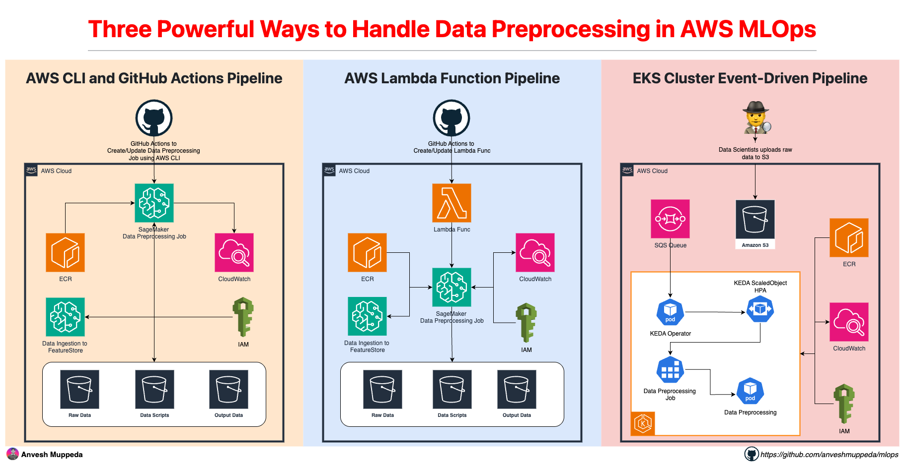

# Three Powerful Ways to Handle Data Preprocessing in AWS MLOps

Data preprocessing is a critical step in any machine learning pipeline. Getting it right can make the difference between a successful ML project and one that struggles with data quality issues. In this post, we'll explore three different approaches to data preprocessing using AWS services, each designed for different use cases and requirements.

## Architecture Overview

*Architecture diagram showing the three data preprocessing approaches: SageMaker Processing with Feature Store, Lambda-triggered processing, and EKS event-driven processing*

## Option 1: AWS CLI and GitHub Actions Pipeline

**Best for:** CI/CD-driven workflows with automated deployment and version control

### What it does:
- Uses AWS CLI commands for infrastructure and job management
- Integrates with GitHub Actions for automated CI/CD workflows
- Supports custom Docker containers and SageMaker Feature Store
- Provides automated deployment and processing pipeline execution

### Key Benefits:
- **CI/CD Integration**: Automated workflows with version control
- **Infrastructure as Code**: Reproducible deployments with CDK
- **Custom Containers**: Enhanced processing capabilities with Docker
- **Feature Store Integration**: Centralized feature management
- **Automated Execution**: GitHub Actions trigger processing jobs

### When to use:
- Teams using GitHub for version control
- CI/CD-driven development workflows
- Automated deployment requirements
- Production environments needing reproducible builds

**👉 [Explore the complete guide →](./015-cdk-data-preprocessing-pipeline/README.md)**

---

## Option 2: AWS Lambda Function Pipeline

**Best for:** Serverless workflows with event-driven processing and minimal infrastructure

### What it does:
- Uses AWS Lambda functions to orchestrate SageMaker Processing Jobs
- Automatically triggers processing when new data arrives in S3
- Provides serverless orchestration with no infrastructure to manage
- Supports multiple trigger mechanisms (S3 events, manual, scheduled)

### Key Benefits:
- **Serverless Architecture**: No infrastructure to manage or maintain
- **Event-Driven**: Automatic processing on data arrival
- **Cost Efficient**: Pay only for execution time
- **Flexible Triggers**: Multiple ways to initiate processing
- **Quick Setup**: Minimal configuration required

### When to use:
- Irregular or unpredictable data processing schedules
- Cost-sensitive environments
- Simple preprocessing workflows
- Teams preferring serverless architectures

**👉 [Explore the complete guide →](./016-cdk-lambda-preprocessing-pipeline/README.md)**

---

## Option 3: EKS Cluster Event-Driven Pipeline

**Best for:** Kubernetes-native environments requiring fine-grained control and advanced scaling

### What it does:
- Uses Amazon EKS clusters for container orchestration
- Implements event-driven processing with KEDA autoscaling
- Automatically scales from 0 to N based on SQS queue depth
- Integrates with S3 events through SQS messaging

### Key Benefits:
- **Kubernetes Native**: Fits naturally into existing K8s workflows
- **Event-Driven Scaling**: Intelligent scaling based on queue depth
- **Resource Control**: Fine-grained resource management
- **Container Flexibility**: Use any container image or framework
- **Zero to Scale**: Scales down to zero when no work available

### When to use:
- Existing Kubernetes infrastructure
- Complex processing requirements needing custom containers
- High-throughput scenarios with variable workloads
- Teams with strong Kubernetes expertise

**👉 [Explore the complete guide →](./018-eks-eventdriven-preprocessing/README.md)**

---

## Comparison Matrix

| Feature | AWS CLI + GitHub Actions | Lambda Functions | EKS Clusters |
|---------|--------------------------|------------------|---------------|
| **Setup Complexity** | Medium | Low | High |
| **Cost Model** | Pay per compute hour | Pay per execution | Pay per pod runtime |
| **Scaling** | Manual/Automatic | Serverless | Event-driven auto |
| **Infrastructure** | Managed | Serverless | Self-managed |
| **CI/CD Integration** | Built-in GitHub Actions | Manual | Manual |
| **Container Flexibility** | Custom Docker images | SageMaker containers | Any container |
| **Kubernetes Integration** | No | No | Native |
| **Deployment Automation** | Yes (GitHub Actions) | Manual | Manual |

## Getting Started

Each approach includes:
- **Complete CDK infrastructure** for reproducible deployments
- **Step-by-step guides** with detailed explanations
- **Sample data and scripts** for immediate testing
- **Troubleshooting guides** for common issues
- **Production best practices** and security considerations

## Choose Your Path

**Start with Lambda Functions** if you're new to MLOps and want quick results with minimal complexity.

**Go with AWS CLI + GitHub Actions** if you need automated CI/CD workflows and reproducible deployments.

**Choose EKS Clusters** if you're already using Kubernetes and need maximum flexibility and control.

## Next Steps

1. Clone the repository: `git clone https://github.com/anveshmuppeda/mlops.git`
2. Choose your preferred approach from the options above
3. Follow the detailed guide for your selected option
4. Customize the solution for your specific use case

Each guide includes everything you need to get started, from infrastructure setup to testing and production deployment.

---

**Ready to build your MLOps pipeline?** Pick the approach that best fits your needs and dive into the detailed implementation guides!